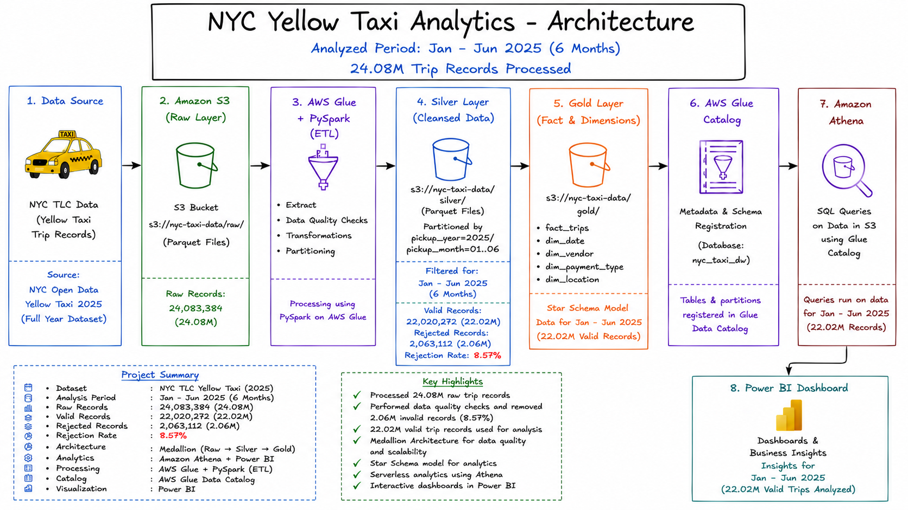

# nyc-yellow-taxi-analytics
End-to-end AWS Data Engineering project using NYC Yellow Taxi data with S3, AWS Glue, PySpark, Athena, and Power BI. Processed 24.08M trip records, applied data quality checks, built a star schema, and delivered business insights through interactive dashboards.

## Overview

This project demonstrates an end-to-end AWS Data Engineering pipeline built using the NYC TLC Yellow Taxi dataset. The solution follows a Medallion Architecture (Raw → Silver → Gold) to ingest, transform, validate, and analyze large-scale taxi trip data.

The project processes over 24 million taxi trip records using AWS Glue and PySpark, performs data quality validations, builds a dimensional model for analytics, and delivers business insights through Amazon Athena and Power BI dashboards.

---

## Project Statistics

| Metric                 | Value                    |
| ---------------------- | ------------------------ |
| Dataset                | NYC TLC Yellow Taxi Data |
| Analysis Period        | Jan 2025 – Jun 2025      |
| Raw Records Processed  | 24,083,384               |
| Valid Records          | 22,020,272               |
| Rejected Records       | 2,063,112                |
| Rejection Rate         | 8.57%                    |
| Total Revenue Analyzed | $621.20M                 |

---

## Architecture



---

## Technology Stack

### AWS Services

* Amazon S3
* AWS Glue
* AWS Glue Data Catalog
* Amazon Athena

### Data Processing

* PySpark
* Parquet

### Analytics & Visualization

* SQL
* Power BI

---

## Medallion Architecture

### Raw Layer

* NYC TLC Yellow Taxi source data stored in Amazon S3
* Original parquet files
* No transformations applied

### Silver Layer

Data quality validations:

* Null handling
* Invalid fare removal
* Invalid distance removal
* Timestamp validation
* Filtering for Jan–Jun 2025

Additional transformations:

* pickup_date
* pickup_year
* pickup_month
* trip_duration_minutes

### Gold Layer

Star schema model created for analytics.

#### Fact Table

* fact_trip

#### Dimension Tables

* dim_payment
* dim_vendor
* dim_ratecode
* dim_location
* dim_date

---

## Data Quality Results

| Metric           |      Count |
| ---------------- | ---------: |
| Raw Records      | 24,083,384 |
| Valid Records    | 22,020,272 |
| Rejected Records |  2,063,112 |

Validation Rules:

* trip_distance > 0
* fare_amount > 0
* dropoff_time > pickup_time

---

## Athena Analytics

Implemented analytical queries including:

1. Monthly Revenue Trend
2. Monthly Trip Volume
3. Average Trip Distance
4. Average Trip Duration
5. Payment Method Distribution
6. Revenue by Payment Type
7. Top 10 Pickup Locations
8. Top 10 Revenue-Generating Pickup Zones
9. Vendor Performance
10. Average Tip by Payment Type

---

## Power BI Dashboard

### Executive Overview

* Total Revenue
* Total Trips
* Average Trip Distance
* Average Trip Duration
* Monthly Revenue Trend
* Monthly Trip Volume
* Payment Method Distribution

### Operational Analysis

* Revenue by Payment Type
* Average Tip by Payment Type
* Vendor Performance
* Top 10 Pickup Locations
* Top Revenue Generating Zones

---

## Key Insights

* Generated $621.20M revenue during the analysis period.
* Processed 24.08M taxi trip records.
* Removed 2.06M invalid records through data quality validation.
* Built a scalable star schema model for analytics.
* Delivered business insights using Athena and Power BI.

---

## Repository Structure

```text
nyc-yellow-taxi-analytics/
│
├── README.md
├── architecture/
├── dashboards/
├── screenshots/
├── sql query results/
└── glue_jobs/
```

---

## Author

**Iswarya Selvakumar**

AWS | PySpark | SQL | Power BI | Data Engineering

