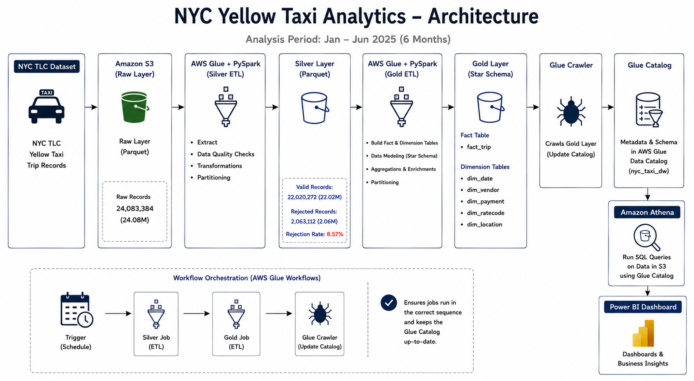
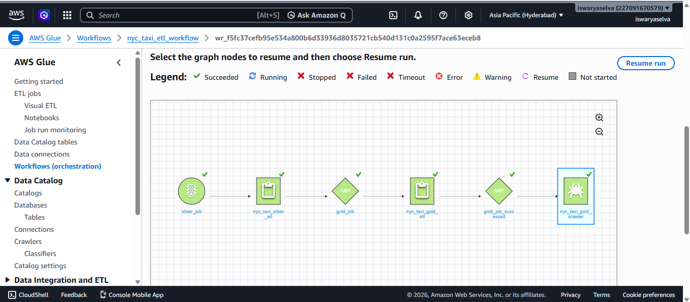
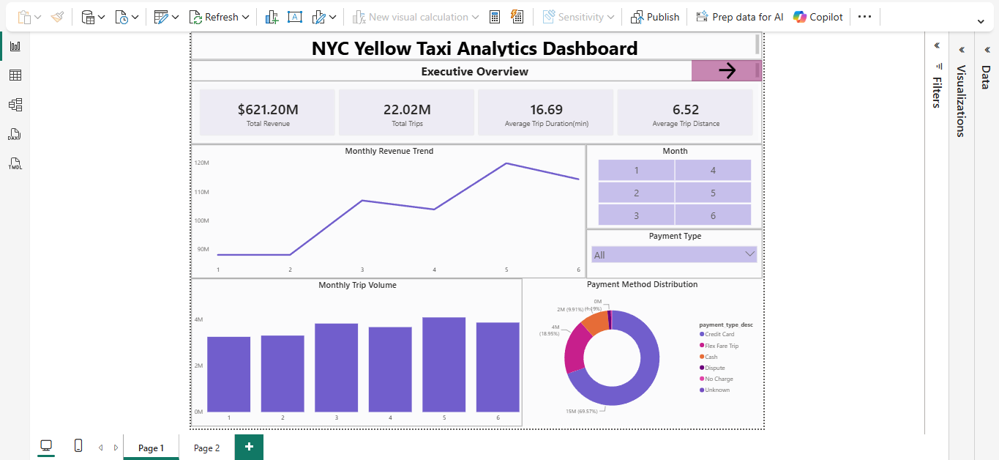
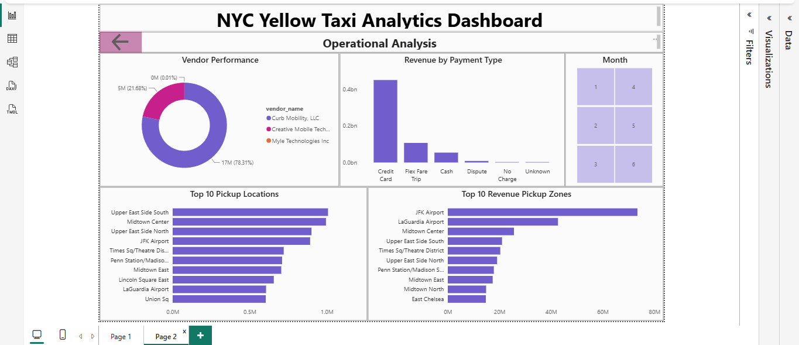

# nyc-yellow-taxi-analytics
End-to-end AWS Data Engineering project using NYC Yellow Taxi data with S3, AWS Glue, PySpark, Athena, and Power BI. Processed 24.08M trip records, applied data quality checks, built a star schema, and delivered business insights through interactive dashboards.

## Project Overview

This project demonstrates an end-to-end Data Engineering pipeline built on AWS using the NYC TLC Yellow Taxi dataset. The solution follows the Medallion Architecture (Raw → Silver → Gold) and processes large-scale taxi trip data using PySpark on AWS Glue.

The pipeline performs data quality validation, transforms raw trip records into curated analytical datasets, builds a dimensional model (Star Schema), and enables business reporting through Amazon Athena and Power BI.

## Business Objective

The objective of this project is to transform raw NYC taxi trip data into a structured analytical platform that supports:

* Revenue analysis
* Trip volume analysis
* Payment method analysis
* Vendor performance analysis
* Location-based insights
* Dashboard reporting and business intelligence

## Dataset

Source: NYC TLC Yellow Taxi Trip Records

Analysis Period: January 2025 – June 2025

### Data Volume

| Metric           | Value      |
| ---------------- | ---------- |
| Raw Records      | 24,083,384 |
| Valid Records    | 22,020,272 |
| Rejected Records | 2,063,112  |
| Rejection Rate   | 8.57%      |

## Architecture

The solution follows a Medallion Architecture:

NYC TLC Dataset
→ Amazon S3 (Raw Layer)
→ AWS Glue + PySpark (Silver ETL)
→ Silver Layer
→ AWS Glue + PySpark (Gold ETL)
→ Gold Layer (Star Schema)
→ AWS Glue Crawler
→ AWS Glue Catalog
→ Amazon Athena
→ Power BI Dashboard

## Technologies Used

* Amazon S3
* AWS Glue
* PySpark
* AWS Glue Catalog
* AWS Glue Workflows
* Amazon Athena
* Power BI
* Parquet File Format

## Silver Layer Processing

The Silver layer performs data cleansing and validation.

### Data Quality Checks

* Null value handling
* Invalid trip distance removal
* Invalid fare amount removal
* Pickup/Dropoff timestamp validation
* Data quality flag generation

### Transformations

* Pickup date extraction
* Pickup year extraction
* Pickup month extraction
* Trip duration calculation
* Partitioning by year and month

## Gold Layer Processing

The Gold layer transforms curated data into a dimensional model for analytics.

### Fact Table

* fact_trip

### Dimension Tables

* dim_date
* dim_vendor
* dim_payment
* dim_ratecode
* dim_location

### Modeling Approach

Star Schema

## Workflow Orchestration

AWS Glue Workflow orchestrates the pipeline execution:

Silver Job
→ Gold Job
→ Glue Crawler

This ensures that the catalog is automatically updated after ETL processing.

## Analytics Queries

The following analytical queries were developed in Amazon Athena:

1. Monthly Revenue Trend
2. Monthly Trip Volume
3. Average Trip Distance
4. Average Trip Duration
5. Payment Method Distribution
6. Revenue by Payment Type
7. Top 10 Pickup Locations
8. Top 10 Revenue Generating Pickup Zones
9. Vendor Performance
10. Average Tip by Payment Type

## Dashboard KPIs

* Total Revenue: $621.20M
* Total Trips: 22.02M
* Average Trip Duration: 16.69 Minutes
* Average Trip Distance: 6.52 Miles

## Dashboard Pages

### Executive Overview

* Revenue Trend
* Trip Volume Trend
* KPI Cards
* Payment Method Distribution

### Operational Analysis

* Vendor Performance
* Revenue by Payment Type
* Top Pickup Locations
* Top Revenue Generating Zones

## Key Learnings

Through this project I gained hands-on experience with:

* Data Lake Architecture
* AWS Glue ETL Development
* PySpark Transformations
* Data Quality Framework Design
* Star Schema Modeling
* Athena Query Optimization
* Workflow Orchestration
* Business Intelligence Dashboard Development
